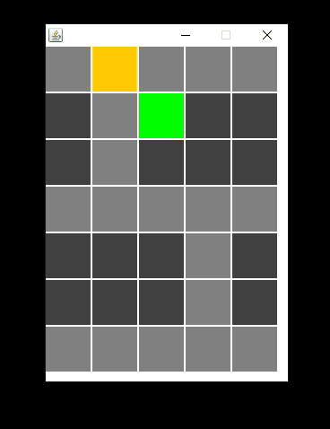

# Town-Simulator
Programming challenge. Given the API documentation for a simulation of a town, define a method, travel(), for a corresponding class,
Vehicle, that will navigate the town, seeking a target location randomly selected by the simulator at run time.

## Official Challenge Description
Given an executable Java Archive, Simulator.jar, which simulates a town, define and add the Vehicle class having a constructor with
the following signature: 
```Java
public Vehicle(Simulator s)
```
and a method, travel() with the following signature:

```Java 
public void travel()
```

that provides the functionality to allow an instance of Vehicle (instantiated by the Simulator class file within Simulator.jar) to navigate the town 
described below. The Simulator proceeds step by step calling the ```travel()``` method once every second, so any code in ```travel()```
should ideally be designed to return control to the simulator's main method after each call. Simulation runs repeatedly until window is 
closed.

### Town Map


## Simulator Running



The Simulator prints messages to the console as it runs. These messages indicate the location of the vehicle as it navigates and 
may assist in writing and debugging the Vehicle class. In the example above the vehicle is represented by the orange square, the goal
by the green, streets by the light gray squares, and buildings by dark gray. In the example, the vehicle drives past the goal and 
crashes at the end of First Street; the crash state is indicated by the vehicle turning red.

The messages printed to the console during this example run of the Simulator looked like this:
```
Continuing on First Street.
Continuing on First Street.
Continuing on First Street.
Crashed on First Street.
```

## Get Started
#### _To complete this challenge you must have the Java Development Kit (JDK 7 minimum)  installed on your device._
To begin, create a Github account if you don't have one, login, and on your homepage click "Explore" in the navigation bar. In the
search box search 
**prgmng-challenge/Town-Simulator** and navigate to this repository. At the top-right click "Fork" to create a copy of this repo in 
your own account. In your forked repo, click the "branch" dropdown, enter a new name and press ENTER to create a new branch to make 
changes to, to avoid altering your original copy of the repo. Navigate to the src folder and click the Simulator.jar file. Click 
"Download" to download a copy of the Simulator.jar file to work with locally. Navigate back to the src folder and do the same for the 
Vehicle.java file. 

### Submitting

Once you are done writing your code, navigate to the 'submissions' folder and read the contents of the _Submission Guidelines_ file. 
Create the folder and contents as described there click "Upload files", upload your folder, and click "Commit Changes" to finalize. 
Next, click "New Pull Request", and finally "Create Pull Request". If this is successful, you will have completed your submission.

Alternatively, you may use GitHub Desktop or a local installation of ```git``` to perform these steps, depending on your comfort with
Github.

[More information](https://help.github.com/en/desktop/contributing-to-projects/creating-a-pull-request)

### Helpful Links
[Download Github Desktop](https://desktop.github.com/)

[Get Started with Github Desktop](https://help.github.com/en/desktop/getting-started-with-github-desktop)

[Install ```git``` locally (not necessary for Github Desktop)](https://git-scm.com/downloads)

[Basics of ```git``` (Command Line)](https://git-scm.com/book/en/v2/Git-Basics-Getting-a-Git-Repository)

### Using the Simulator
In the folder [prgmng-challenge/Town-Simulator/src](src/) you will find a Java Archive (.jar) file named ```Simulator.jar``` and a template
for the Vehicle class named ```Vehicle.java```. To build and test your code, You will complete the definition of the Vehicle class, 
compile, then add the resulting .class file to Simulator.jar by using the ```jar``` tool in the terminal or Command Prompt. This 
is done as follows:

#### Add class file to JAR
```jar uf Simulator.jar Vehicle.class```

#### Remove class file from JAR (Windows)
```
jar xf Simulator.jar <-- Extract JAR, use an empty directory
del Vehicle.class <-- Change del to rm for UNIX/Linux
jar cvfm Simulator.jar META-INF\MANIFEST.MF *.class <--Use forward slash for UNIX/Linux
```

#### Run JAR File
```
java -jar Simulator.jar
```

# API Documentation
## public class Simulator
### Methods:
**public String get_location()**<br/>
  Returns current location of vehicle as a String.<br/>
  
**public String get_goal()**<br/>
  Returns target location set at run time as a String.<br/>
  
**public String look_ahead(String direction)**<br/>
  Takes as an argument a cardinal direction: "NORTH", "SOUTH", "EAST", "WEST". Returns the location one step ahead as a String.<br/>
  
**public void drive(String direction)**<br/>
  Accepts as an argument a cardinal direction: "NORTH", "SOUTH", "EAST", "WEST". Moves the vehicle in the direction indicated in the 
  argument.<br/>
  
### Samples:

if location is currently somewhere on Main Street the following prints **"Main Street"**.
```Java
Simulator simulator = new Simulator();
current_location = simulator.get_location()
System.out.println(current_location); 
```
If location just ahead in the direction given is off the map or a location that would result in a crash, such as a building, 
the following prints **"Invalid Location"**.
```Java
Simulator simulator = new Simulator();
looking_west = simulator.look_ahead("WEST")
System.out.println(looking_west); 
```

